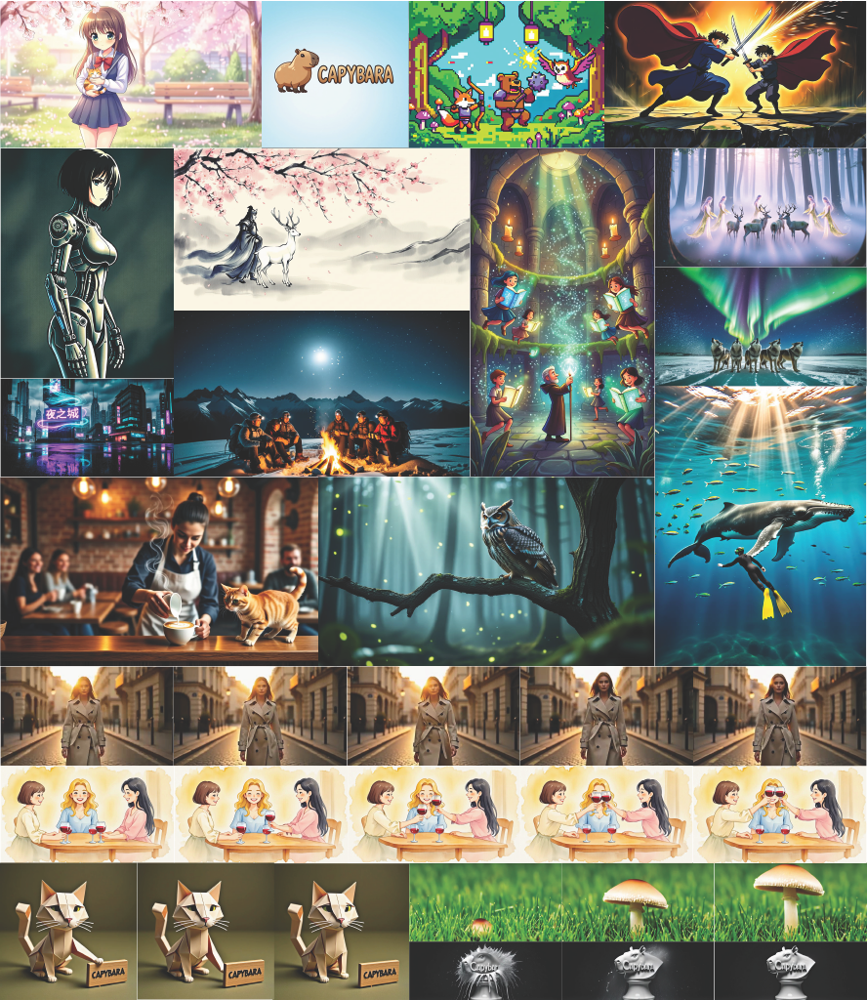
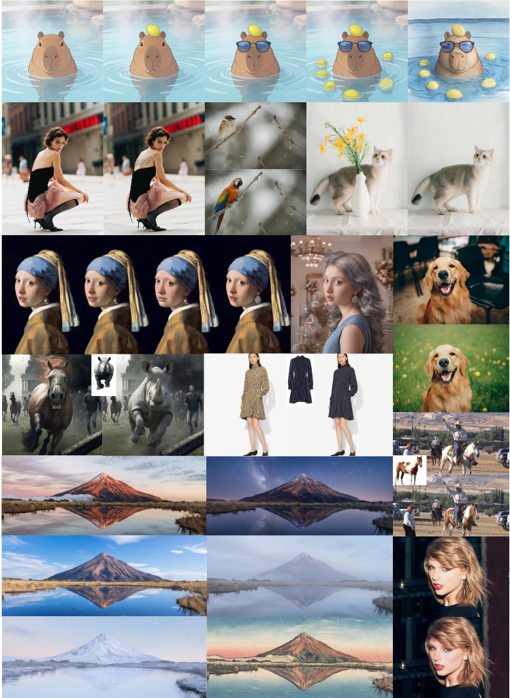
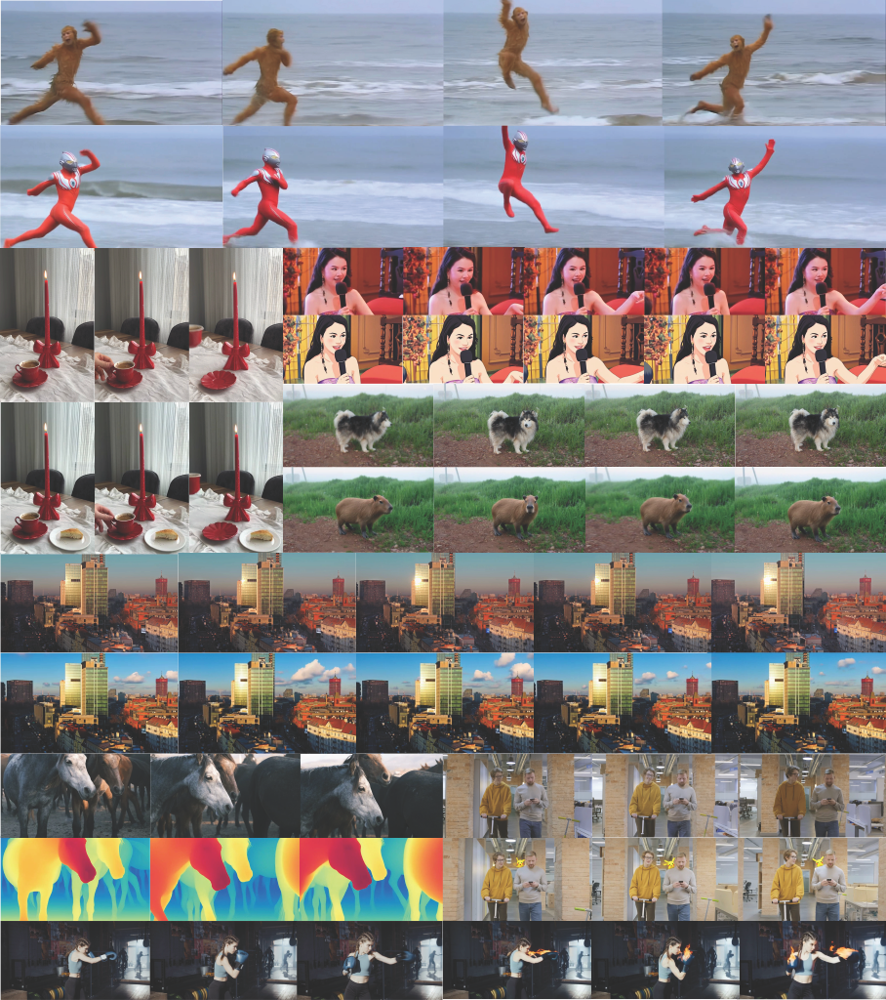
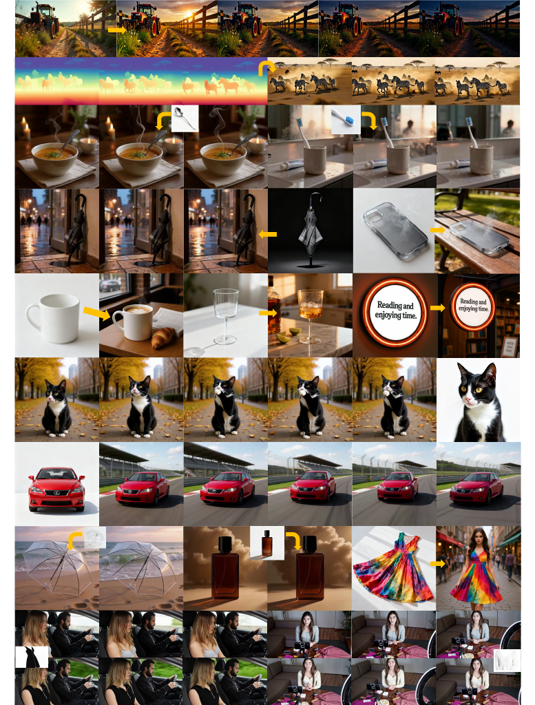

<p align="center">

</p>

# CAPYBARA: A Unified Visual Creation Model

<div align="center">
  <a href=https://lllydialee.github.io/Capybara-Project-Page target="_blank">
  <a href=https://huggingface.co/xgen-universe/Capybara target="_blank"></a>
  <a href=https://github.com/xgen-universe/Capybara target="_blank"></a>
  <a href="https://inappetent-acrophonically-alison.ngrok-free.dev/" target="_blank"></a>
  <a href="https://github.com/xgen-universe/Capybara/blob/main/assets/docs/tech_report.pdf" target="_blank"></a>
  <a href="https://pub-7ba77a763b8142cea73b9e48b46830ca.r2.dev/wechat.jpg" target="_blank"></a>
  
</div>

<p align="center">
    🎉 Welcome to visit our <a href=https://lllydialee.github.io/Capybara-Project-Page>Project Page</a> | 
💻 Visit our <a href="https://inappetent-acrophonically-alison.ngrok-free.dev/">Demo Website</a> to try our model!
</p>

**Capybara** is a unified visual creation model, i.e., a powerful visual generation and editing framework designed for high-quality visual synthesis and manipulation tasks.

The framework leverages advanced diffusion models and transformer architectures to support versatile visual generation and editing capabilities with precise control over content, motion, and camera movements.

<!-- <table>
  <tr>
    <td align="center">
    <video src="https://pub-7ba77a763b8142cea73b9e48b46830ca.r2.dev/demo_video.mp4" controls="controls" style="max-width: 100%;">
    </video>
    <br>
      <sub>Speech-driven base clips generated by Seedance 2.0. All editing powered by CAPYBARA</sub>
    </td>
  </tr>
</table> -->

**Key Features:**

* 🎬 **Multi-Task Support**: Supports Text-to-Video (T2V), Text-to-Image (T2I), Instruction-based Video-to-Video (TV2V), Instruction-based Image-to-Image (TI2I), and various editing tasks
* 🚀 **High Performance**: Built with distributed inference support for efficient multi-GPU processing

## 🔥 News

* **[2026.02.20]** 🎨 Added [ComfyUI support](#-comfyui-support) with custom nodes for all task types (T2I, T2V, TI2I, TV2V), together with [FP8 quantization](#-fp8-quantization) support for the inference script and ComfyUI custom node.
* **[2026.02.17]** 🚀 Initial release v0.1 of the Capybara inference framework supporting generation and instruction-based editing tasks (T2I, T2V, TI2I, TV2V).

## 📝 TODO List
- [x] Add support for ComfyUI.
- [ ] Release our unified creation model.
- [ ] Release training code.

<!-- ## 🏞️ Show Caeses
**Results of generation tasks.** We show two generation tasks under our unified model. The top section presents text-to-image results, illustrating high-fidelity synthesis across diverse styles. The bottom rows show text-to-video results, demonstrating temporally coherent generation with natural motion for both realistic and stylized content.
<p align="center">

</p>

**Results of image editing tasks.** We show the results of both instruction-based image editing and in-context image editing. The examples cover local and global edits (e.g., time-of-day and style changes), background replacement, and expression control. We further demonstrate multi-turn editing, where edits are applied sequentially. We also show in-context editing guided by a refenece image.
<p align="center">

</p>

**Results of instruction-based video editing task.** We showcase instruction-based editing (TV2V) under our unified creation interface, covering local edits, global edits, dense prediction, and dynamic edits. Each example presents input frames and the edited outputs, highlighting temporally coherent transformations that preserve identity and overall structure.
<p align="center">

</p>

**Results of in-context visual creation.** We show in-context generation and in-context editing results , including subject-conditioned generation (S2V/S2I), conditional generation(C2V), image-to-video(I2V), reference-driven editing (II2I/IV2V).
<p align="center">

</p> -->

## 🛠️ Installation

We recommend using Anaconda to create an isolated Python environment and recommend using CUDA 12.6:

```bash
# Clone the repository
git clone https://github.com/xgen-universe/Capybara.git
cd Capybara

# Create environment
conda create -n capybara python=3.11 -y
conda activate capybara

# Install pytorch (torch 2.6.0 with CUDA 12.6)
pip install torch==2.6.0 torchvision==0.21.0 torchaudio==2.6.0 --index-url https://download.pytorch.org/whl/cu126

# Install dependencies
pip install -r requirements.txt

# [Optional] Install Flash Attention for faster inference
pip install flash_attn --no-build-isolation
```

## 📥 Model Download

Capybara requires the following model components:

| Models              | Download Link                                                                | Description                       |
| ------------------- | ---------------------------------------------------------------------------- | --------------------------------- |
| **Model**           | [Huggingface Model](https://huggingface.co/xgen-universe/Capybara)                                                            | All Mandatory Models                        |
| **Rewrite Model**   | [Huggingface Model](https://huggingface.co/Qwen/Qwen3-VL-8B-Instruct)                                                            | Qwen3-VL-8B-Instruct for Rewrite Instruction|

Download the required models and organize them in the following structure:

```bash
ckpts/
├── scheduler/
│   └── scheduler_config.json
├── text_encoder/
│   ├── byt5-small/
│   ├── Glyph-SDXL-v2/
│   └── llm/
├── transformer/
│   └── capybara_v01/
├── vae/
└── vision_encoder/
    └── siglip/
```

## 🚀 Inference & Quick Start

Capybara supports two inference modes: **Single Sample Mode** for quick testing with a single input, and **Batch Mode** for processing multiple samples via CSV files. Both modes support all task types.

We provide example scripts under `script/` and example data under `assets/` to help you get started quickly:

```
assets/
├── examples/           # Example media files
│   ├── img1.jpeg
│   ├── img2.jpeg
│   ├── video1.mp4
│   └── video2.mp4
└── test_data/          # Example CSV files for batch mode
    ├── ti2i_example.csv
    └── tv2v_example.csv
```

### Single Sample Mode

Process a single image or video with a text prompt. See `script/test_single_infer.sh` for full examples.

**Instruction-based Image-to-Image (TI2I):**

```bash
python inference.py \
    --pretrained_model_name_or_path ./ckpts \
    --media_path ./assets/examples/img1.jpeg \
    --prompt "Change the time to night." \
    --output_path ./results/test_single_output/ti2i \
    --num_inference_steps 50 \
    --task_type ti2i \
    --resolution 720p \
    --rewrite_instruction
```

**Instruction-based Video-to-Video (TV2V):**

```bash
python inference.py \
    --pretrained_model_name_or_path ./ckpts \
    --media_path ./assets/examples/video1.mp4 \
    --prompt "Replace the monkey with Ultraman. Keep the Ultraman's motion matched the original running pose and motion of monkey." \
    --output_path ./results/test_single_output/tv2v \
    --num_inference_steps 50 \
    --num_frames 81 \
    --task_type tv2v \
    --resolution 480p \
    --rewrite_instruction
```
<details>
<summary> More inference examples about generation tasks (T2I/T2V)</summary>

**Text-to-Video (T2V):**

```bash
python inference.py \
    --pretrained_model_name_or_path ./ckpts \
    --prompt "A giant humpback whale and its calf gracefully swim in the crystal-clear, deep blue open ocean." \
    --output_path ./results/test_single_output/t2v \
    --guidance_scale 4 \
    --num_inference_steps 50 \
    --num_frames 81 \
    --task_type t2v \
    --resolution 480p \
    --aspect_ratio "16:9" \
    --rewrite_instruction
```

**Text-to-Image (T2I):**

```bash
python inference.py \
    --pretrained_model_name_or_path ./ckpts \
    --prompt "A group of five hikers, sitting on the snow mountain." \
    --output_path ./results/test_single_output/t2i \
    --guidance_scale 4 \
    --num_inference_steps 50 \
    --task_type t2i \
    --resolution 720p \
    --aspect_ratio "16:9" \
    --rewrite_instruction
```
</details>

### Batch Mode (CSV)

Process multiple samples using a CSV file. See `script/test_infer.sh` for a full example.

#### CSV Format

For editing tasks (TI2I / TV2V), prepare a CSV with `img_path`/`video_path` and `instruction` columns:

```csv
img_path,instruction
img1.jpeg,instruction1.
img2.jpeg,instruction2.
```

> The path column holds relative paths to media files (images or videos) under the data root directory.

Example CSV files are provided in `assets/test_data/`.

#### Single GPU

```bash
python inference.py \
    --pretrained_model_name_or_path ./ckpts \
    --csv_path ./assets/test_data/ti2i_example.csv \
    --data_root_path ./assets/examples \
    --output_path ./results/test_output/ti2i-480p \
    --num_inference_steps 50 \
    --num_frames 81 \
    --task_type ti2i \
    --resolution 720p \
    --rewrite_instruction
```

#### Multi-GPU (Distributed)

Use `accelerate` for distributed inference across multiple GPUs:

```bash
accelerate launch --config_file acc_config/accelerate_config.yaml --num_processes 2 inference.py \
    --pretrained_model_name_or_path ./ckpts \
    --csv_path ./assets/test_data/ti2i_example.csv \
    --data_root_path ./assets/examples \
    --output_path ./results/test_output/ti2i-480p \
    --num_inference_steps 50 \
    --num_frames 81 \
    --task_type ti2i \
    --resolution 720p \
    --rewrite_instruction
```

## 🎨 ComfyUI Support

Capybara provides custom ComfyUI nodes for all task types (T2V, T2I, TI2I, TV2V).

```bash
ln -s /path/to/Capybara /path/to/ComfyUI/custom_nodes/Capybara
```

| Node | Description |
| --- | --- |
| **Capybara Load Pipeline** | Load all model components with automatic attention backend selection |
| **Capybara Generate** | Main generation / editing node for all task types |
| **Capybara Load Video** | Load a video file as IMAGE frames + fps |
| **Capybara Load Rewrite Model** | Load Qwen3-VL for prompt rewriting |
| **Capybara Rewrite Instruction** | Expand short prompts into detailed instructions |

A sample workflow is provided in [`comfyui/examples/`](comfyui/examples/). For setup details and node documentation, see the [ComfyUI README](comfyui/README.md).

## ⚙️ Configuration Details

### Task Types

| Task Type | Description                                | Input Required          |
| --------- | ------------------------------------------ | ----------------------- |
| `t2v`     | Text-to-Video generation                   | `--prompt`              |
| `t2i`     | Text-to-Image generation                   | `--prompt`              |
| `ti2i`    | Instruction-based Image-to-Image editing   | `--media_path` + `--prompt` (or CSV) |
| `tv2v`    | Instruction-based Video-to-Video editing   | `--media_path` + `--prompt` (or CSV) |

### Key Parameters

| Parameter                  | Default     | Description                                                |
| -------------------------- | ----------- | ---------------------------------------------------------- |
| `--pretrained_model_name_or_path` | (required)  | Path to the model checkpoint directory                    |
| `--task_type`              | `tv2v`      | Task type: `t2v`, `t2i`, `ti2i`, `tv2v`                   |
| `--resolution`             | `None`      | Output resolution: `480p`, `720p`, `1080p`                 |
| `--aspect_ratio`           | `None`      | Aspect ratio: `16:9`, `9:16`, `4:3`, `3:4`, `1:1`         |
| `--num_frames`             | `81`        | Number of frames to generate (e.g., 81, 101, 121)         |
| `--num_inference_steps`    | `50`        | Number of denoising steps                                  |
| `--guidance_scale`         | `1.0`       | Text guidance scale for classifier-free guidance           |
| `--num_sample_per_case`    | `1`         | Number of samples to generate per input                    |
| `--rewrite_instruction`    | `False`     | Auto-enhance prompts using Qwen3-VL-8B-Instruct           |
| `--rewrite_model_path`     | `Qwen/Qwen3-VL-8B-Instruct` | Path to the rewrite model              |
| `--max_samples`            | `None`      | Limit the number of samples to process from CSV            |
| `--quantize`               | `None`      | Quantize transformer weights (`fp8`). See [FP8 Quantization](#-fp8-quantization). |

### Recommended Settings

For optimal quality and performance, we recommend the following settings:

| Task Type | Recommended Resolution | Recommended Steps | Note                                   |
| --------- | --------------------- | ----------------- | -------------------------------------- |
| **Video** (T2V, TV2V) | `480p`       | `50`              | Balanced quality and generation speed  |
| **Image** (T2I, TI2I) | `720p`       | `50`              | Higher quality for static images       |

**Notes:**
- **Resolution**: You can experiment with higher resolutions (`1024` or `1080p`).
- **Inference Steps**: 50 steps provide a good balance between quality and speed. You can use 30-40 steps for faster generation.

## ⚡ FP8 Quantization

Capybara supports FP8 (E4M3) weight-only quantization for the transformer via [torchao](https://github.com/pytorch/ao). This roughly halves the transformer's weight memory, allowing larger resolutions or longer videos to fit in GPU VRAM.

**Requirements:**
- NVIDIA GPU with compute capability >= 8.9 (Ada Lovelace or Hopper, e.g. RTX 4090, L40, H100)
- `torchao` installed (`pip install torchao`)

### Inference Script

Add `--quantize fp8` to any `inference.py` command:

```bash
python inference.py \
    --pretrained_model_name_or_path ./ckpts \
    --media_path ./assets/examples/video1.mp4 \
    --prompt "Replace the monkey with Ultraman." \
    --output_path ./results/test_fp8 \
    --num_inference_steps 50 \
    --num_frames 81 \
    --task_type tv2v \
    --resolution 480p \
    --quantize fp8
```

### ComfyUI

In the **Capybara Load Pipeline** node, set the `quantize` dropdown to **fp8**. The node handles everything automatically -- the transformer will be loaded in FP8 on GPU while other components (VAE, text encoders, etc.) still offload to CPU as usual.

### How It Works

- **Weights** are stored in FP8 format (roughly half the memory of bf16/fp16).
- **Activations and compute** remain in the dtype you select (bf16 or fp16). Only the weights are quantized; they are dequantized on the fly during matrix multiplications.
- When FP8 is enabled with CPU offloading, the transformer stays pinned on GPU (quantized tensors cannot be moved between devices). All other models still offload normally.

## 📄 License

This project is released under the MIT License.

## 🙏 Acknowledgments

This project is built upon:
- [HunyuanVideo-1.5](https://github.com/Tencent-Hunyuan/HunyuanVideo-1.5) - Base Video Generation Model
- [Diffusers](https://github.com/huggingface/diffusers) - Diffusion pipeline infrastructure
- [Accelerate](https://github.com/huggingface/accelerate) - Distributed training/inference
- [SageAttention](https://github.com/thu-ml/SageAttention) - Efficient attention mechanism

## 📝 Citation

If you find Capybara useful for your research, please consider citing:

```bibtex
@misc{capybara2026rao,
  title={Capybara: A Unified Visual Creation Model},
  author={Rao, Zhefan and Che, Haoxuan and Hu, Ziwen and Zou, Bin and Liu, Yaofang and He, Xuanhua and Choi, Chong-Hou and He, Yuyang and Chen, Haoyu and Su, Jingran and Li, Yanheng and Chu, Meng and Lei, Chenyang and Zhao, Guanhua and Li, Zhaoqing and Zhang, Xichen and Li, Anping and Liu, Lin and Tu, Dandan and Liu, Rui},
  year={2026}
}
```

## 📧 Contact

For questions and feedback, please open an issue on GitHub.

You can also contact us by email: zraoac@ust.hk and hche@ust.hk

---

⭐ If you find this project helpful, please consider giving it a star!
